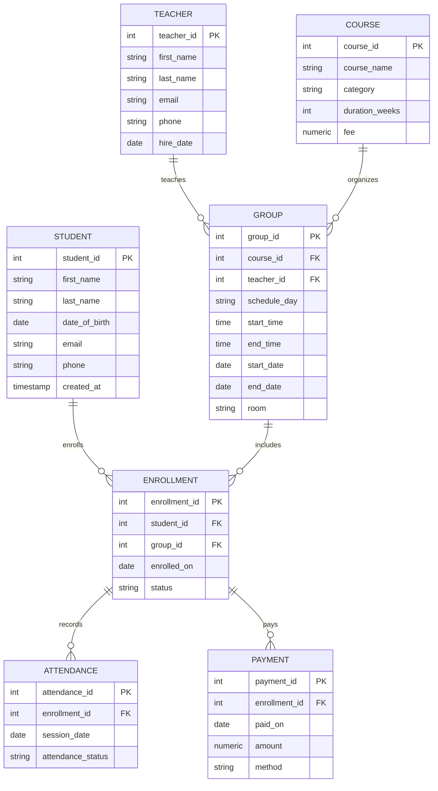

# Education Center Database Project (PostgreSQL)

**Unit:** Pearson BTEC HND in Digital Technologies – Unit 10 Database Design and Development  
**Scenario:** Education center offering programming, languages, and short-term certification courses.  
**Database Platform:** PostgreSQL  

---

## 1. User and System Requirements

### 1.1 User Requirements
The system must provide the education center staff with the ability to:

1. Enroll and manage student information.
2. Create and manage courses and groups.
3. Attach teachers to courses or groups.
4. Sign students into groups and track group membership.
5. Track attendance and payments.
6. Generate simple management reports.

### 1.2 System Requirements
The database must:

- Be implemented as a relational database (PostgreSQL).
- Use at least four interrelated tables.
- Enforce data integrity using keys and constraints.
- Support cross-table requests (multi-table schedules and reporting).
- Be expandable for future needs (additional entities or attributes).

---

## 2. Conceptual Design (ERD)



**Cardinality summary:**

- One student can have many enrollments.
- One course can have many groups.
- One teacher can teach many groups.
- Each group can have many enrollments.
- Each enrollment can have many attendance records and payments.

---

## 3. Normalization (Evidence to 3NF)

### 3.1 Unnormalized Form (UNF)
A single spreadsheet could include repeating groups such as:

```
StudentName, StudentEmail, CourseName, GroupSchedule, TeacherName,
AttendanceDates[], PaymentDates[], PaymentAmounts[]
```
This causes duplication and update anomalies.

### 3.2 First Normal Form (1NF)
- Remove repeating groups (attendance and payments) into separate rows.
- Ensure each column holds atomic values.

### 3.3 Second Normal Form (2NF)
- Separate composite entities into new tables.
- Example: attendance records depend on *enrollment* not just student or group.

### 3.4 Third Normal Form (3NF)
- Remove transitive dependencies (e.g., teacher details stored only in TEACHER table).
- Course data stored in COURSE, group schedule in GROUP, and enrollment details in ENROLLMENT.

### 3.5 Final Design Justification
- Each entity has a single purpose.
- Relationships are enforced with foreign keys.
- Redundancy is minimized, preventing update and insert anomalies.

---

## 4. Database Development (PostgreSQL)

### 4.1 Schema Implementation
- Tables created with appropriate data types.
- Constraints enforced using `PRIMARY KEY`, `FOREIGN KEY`, `NOT NULL`, `UNIQUE`, and `CHECK`.
- `ON DELETE` behavior is defined for referential integrity.

### 4.2 Test Data
Meaningful data inserted to validate:

- Multiple groups per course.
- Multiple students per group.
- Attendance and payment tracking.

---

## 5. Queries and Management Reports

The SQL script provides queries to:

- List students and their group schedules.
- Show teacher workloads.
- Report revenue per course and per group.
- Display attendance rate by group.
- Identify students with unpaid balances.

---

## 6. Testing (LO3)

Testing verifies:

- User requirements (enrollment, attendance, payment).
- System constraints (integrity and validation).
- Structural correctness (relationships and keys).

**Evidence provided in:** `docs/test-plan.md`

---

## 7. Technical and User Documentation (LO4)

- **Technical documentation:** `docs/technical-doc.md`
- **User documentation:** `docs/user-guide.md`
- **Data dictionary:** `docs/data-dictionary.md`
- **Data flow and process diagrams** (included in technical documentation).

---

## 8. Evaluation (D1, D2, D4)

- **Design effectiveness:** The ERD satisfies all requirements with normalized, scalable structure.
- **System effectiveness:** Queries deliver management insights; constraints protect data integrity.
- **Improvements:** Future enhancements could include invoicing, online portal integration, and audit logging.

---

## 9. References (Harvard)

- Churcher, C. (2012) *Beginning Database Design: From Novice to Professional*. 2nd edn. Apress.
- Connolly, T. and Begg, C. (2014) *Database Systems: A Practical Approach to Design, Implementation and Management*. 6th edn. Pearson.
- Kroenke, D. and Auer, D. (2012) *Database Concepts*. 6th edn. Pearson.
- Paulraj, P. (2008) *Database Design and Development: An Essential Guide for IT Professional*. Wiley.
- Stephens, R. (2008) *Beginning Database Design Solutions*. Wrox.
