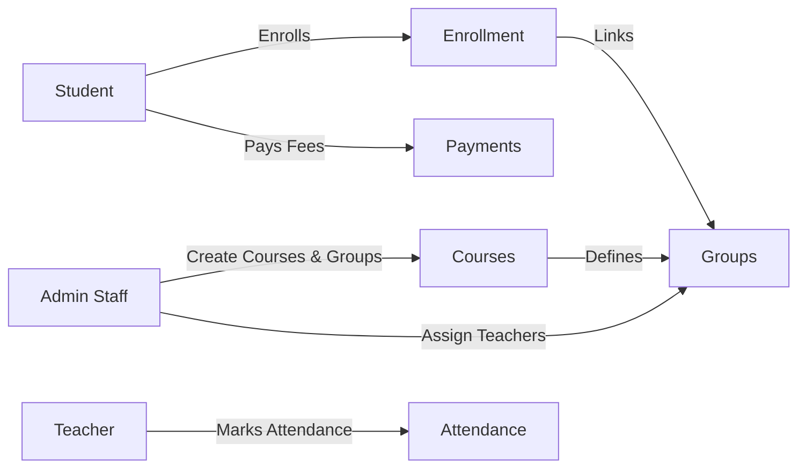
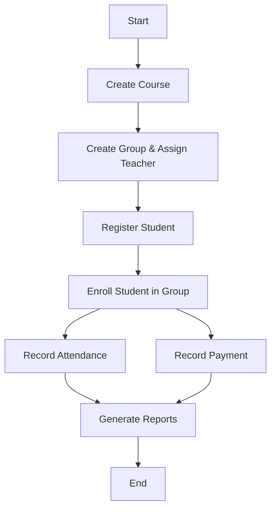

# Technical Documentation

## 1. Overview
This database centralizes student enrollment, course delivery, attendance, and payment records for an education center. PostgreSQL is used to ensure relational integrity, scalability, and advanced querying capabilities.

---

## 2. Database Schema Description

### 2.1 Entities
- **STUDENT**: Stores student profile data.
- **TEACHER**: Stores teacher profile data.
- **COURSE**: Stores course definitions and fee information.
- **GROUP**: Represents a scheduled delivery of a course taught by a teacher.
- **ENROLLMENT**: Links students to groups.
- **ATTENDANCE**: Records attendance per session.
- **PAYMENT**: Stores payments linked to enrollments.

### 2.2 Keys and Constraints
- Primary keys are surrogate integers.
- Foreign keys enforce relationships.
- Unique constraints prevent duplication (e.g., student email, teacher email).
- Check constraints validate positive fees and payment amounts.

---

## 3. Data Dictionary
A full data dictionary is provided in `docs/data-dictionary.md`.

---

## 4. Data Flow Diagram (DFD)

---

## 5. Process Flow (Block Diagram)

---

## 6. Maintenance Considerations
- Regular backups using `pg_dump`.
- Index review on frequently queried columns.
- Periodic review of constraint violations.
- Archive completed groups to a history schema if needed.

---

## 7. Security and Access Control
- Define roles such as **admin**, **teacher**, and **staff**.
- Restrict insert/update access to sensitive tables (payments).
- Read-only access for reporting users.
